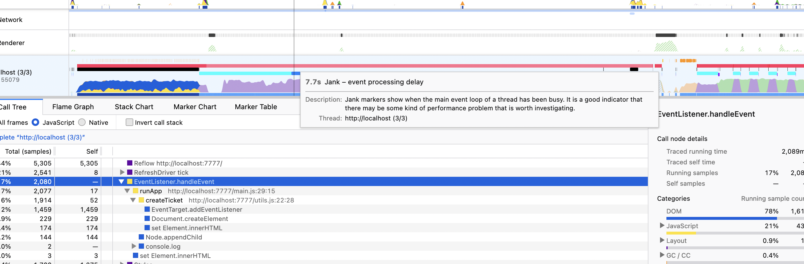

# Решение в лоб

Давайте сначала просто напишем базовый код и первое решение.

HTML код `index.html`

```html
<!DOCTYPE html>
<html>
<head>
  <meta charset="utf-8">
  <meta name="viewport" content="width=device-width, initial-scale=1">
  <title>Lucky ticket</title>
</head>
<body>
  <button id="start">start</button>
  <div id="app"></div>
  <script type="module" src="main.js"></script>
</body>
</html>
```

вспомогательные функции `utils.js`

```js
export function normalizeNumber(numberStr) {
  return numberStr.padStart(6, 0);
}

export function calcNumbersSum(str) {
  return str.split('').reduce((acc, curr) => Number(curr) + acc, 0);
}

export function checkIsHappy(numberStr) {
  const normalizedNumber = normalizeNumber(numberStr);
  const leftSide = normalizedNumber.slice(0, 3);
  const rightSide = normalizedNumber.slice(3);
  return calcNumbersSum(leftSide) === calcNumbersSum(rightSide);
}

export function handleTicketClick(e) {
  const { target } = e;
  const numberStr = target.innerHTML;
  alert(`${normalizeNumber(numberStr)}, ${checkIsHappy(numberStr) ? 'счастливый' : 'несчастливый'}`);
}

export function createTicket(i) {
  const $ticket = document.createElement('button');
  $ticket.innerHTML = i;
  $ticket.addEventListener('click', handleTicketClick);
  return $ticket;
}
```

и основной файл `main.js`

```js
import { normalizeNumber, checkIsHappy, handleTicketClick, createTicket } from './utils.js';

const $start = document.getElementById('start');
const $app = document.getElementById('app');

let startTime, endTime;

function runApp() {
  startTime = performance.now();
  for (let i = 0; i < 999_999; i++) {
    const $ticket = createTicket(i);
    $app.appendChild($ticket);
  }
  endTime = performance.now();
  console.log(`Call took ${endTime - startTime} milliseconds`);
}

$start.addEventListener('click', runApp.bind(null, 0));
```

Для запуска этого приложения нужен сервер, я использую [serve](https://www.npmjs.com/package/serve), но можно просто запустить `python3 -m http.server 7777`, если вы предпочитаете питон.

Запустив этот код, вы сразу почувствуете недовольство компьютера – у меня хром стабильно падает, видимо срабатывает защита, а ФФ стойко терпит и доводит дело до конца примерно за полминуты.

ФФ – `Call took 1367 milliseconds`
Chrome – `Call took 1614 milliseconds`, но в итоге -> Aw, Snap!

Интересно заметить, что ФФ сначала выполняет JS часть кода и только потом переходит к рендеру элементов. Кнопки отрисовываются примерно через пару секунд после сообщения в консоли.

Судя по профайлеру ФФ, страничка отъедает 1 GB памяти, _но это не точно_.



Красная полоса свидетельствует о проблемах, советуют поразбираться. Хорошо, давайте перепишем!

Попробуем выполнить создание билетиков рекурсией? Интервьюеры яндекса очень не любят это слово, но мы не боимся проблем!

```JS
function runApp(i) {
  if (i === 0) {
    startTime = performance.now();
  }

  if (i >= 999_999) {
    const endTime = performance.now();
    console.log(`Call took ${endTime - startTime} milliseconds`);
    return;
  };

  const $ticket = createTicket(i);
  $app.appendChild($ticket);

  return runApp(++i);
}
```

`Uncaught InternalError: too much recursion` - браузер тоже не любит рекурсии. Сработала защита от бесконечного вызова функции с выходом в ошибку. Исправлять все это мы будем в следующей статье,


