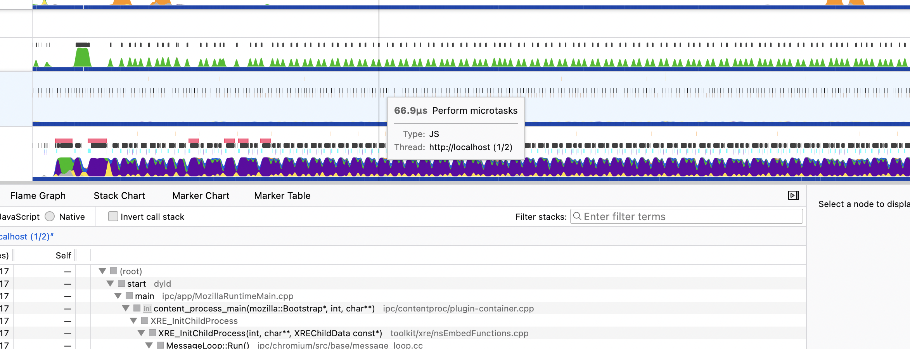
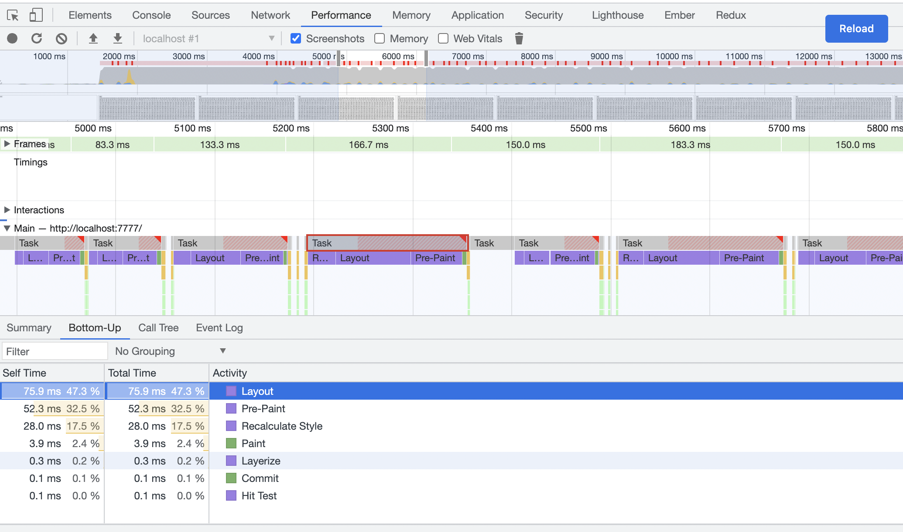
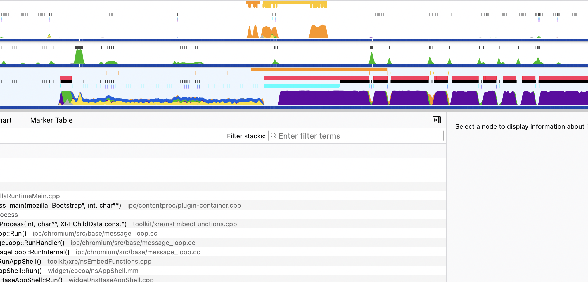

social_tags_title: Задача "Счастливый билетик" - Разделяем задачу на последовательность подзадач
description: Разделяем задачу на последовательность подзадач
author: @ollar
date_created: 2023-05-17
is_editable: true

# Разделяем задачу на последовательность подзадач

## Основная идея

Проблема заключается в том, что наша задача очень ресурсоемкая, и браузер тратит все силы на ее выполнение. В этот момент он не может выполнять запросы к серверу, отрисовывать UI и вообще не хочет нас замечать. Раз тяжело все сделать в одном фрейме, то может быть есть способ разбить задачу на несколько? 

Конечно есть, нам поможет функция отложенного выполнения `setTimeout`. Она позволяет выполнить функцию в каком-то недалеком будущем и браузер сразу планирует её испольнение в другом фрейме.

### Переписываем код

``` js
function runApp(i) {
  if (i === 1) {
    startTime = performance.now();
  }

  if (i >= 1_000_000) {
    const endTime = performance.now();
    console.log(`Call took ${endTime - startTime} milliseconds`);
    return;
  };

  const $ticket = createTicket(i);
  $app.appendChild($ticket);

  if (i % 5000 === 0) {
    return setTimeout(() => runApp(++i));
  }
  return runApp(++i);
}
```

При исполнении этого кода сразу заметно, что кнопки показываюся практически мгновенно, зато сама функция выполнялась в 20 раз дольше.
В профайлере видно, что красная полоса проблем теперь не выглядит монолитно, видны просветы. А задачи js чередуются с рендером.


Время выполнения:

ФФ - `Call took 23253 milliseconds`
Chrome - Aw, snap! так и не окончив работу.

Так не пойдет, нам нужна оптимизация!

### Сокращаем количество обработчиков событий

Для начала давайте разберем функцию создания кнопки: на каждую кнопку, у нас добавляется обработчик события нажатия, в котором происходит примерно одно и то же. Миллион обработчиков сидят в памяти – это чересчур. Давайте лучше повесим один обработчик нажатий на родительский узел.

`main.js`

``` js
$app.addEventListener('click', handleTicketClick);
```

`utils.js`

``` js
export function createTicket(i) {
  const $ticket = document.createElement('button');
  $ticket.innerHTML = i;
  return $ticket;
}
```

### Сокращаем количество взаимодействий с DOM

В функции `runApp` после каждого созданного билетика, мы обновляем DOM. Это тоже можно оптимизировать, группируя кнопки в каком-либо враппере. В таком случае, создавать кнопки уже не нужно, мы можем хранить информацию о кнопках в виде текста:

`utils.js`

``` js
export function createTicket(i) {
  return `<button>${i}</button>`;
}

```

`main.js`

``` js
function runApp(i, res = '') {
  if (i === 1) {
    startTime = performance.now();
  }

  if (i >= 1_000_000) {
    render(res);
    const endTime = performance.now();
    console.log(`Call took ${endTime - startTime} milliseconds`);
    return;
  };

  const $ticket = createTicket(i);

  res += $ticket;

  if (i % 5000 === 0) {
    render(res);
    return setTimeout(() => runApp(++i));
  }
  return runApp(++i, res);
}

function render(htmlString) {
  const elem = document.createElement('div');
  elem.innerHTML = htmlString;
  $app.appendChild(elem);
}
```

выполняем

ФФ - `Call took 5397 milliseconds`
Chrome - `Call took 50271.80000000447 milliseconds` зато больше не падает :)

Я не понимаю, почему хром работает настолько медленнее файрфокса, видимо, налицо особенности работы движка.

Профайлер ФФ:



Chrome:



### Используем хаки css

Как видим, красная полоса заметно уменьшилась, значит наша оптимизация была полезной! Судя по данным хрома, основная работа у него уходит на перерасчет и отрисовку элементов на странице. Давайте поможем ему с помощью css

`index.html`

``` html
<head>
  ...

  <style type="text/css">
    #app > div {
      transform: translateZ(0);
    }
  </style>

</head>
```

новый результат в хроме - `Call took 17353.79999999702 milliseconds` - уже лучше!

Может быть если браузер вообще не будет ничего рисовать, получится еще быстрее?

Давайте попробуем скрыть все билетики кроме начальных, чтобы браузер вообще их не рисовал.

`index.html`

``` html
<style type="text/css">
  #app > div {
    transform: translateZ(0);
  }

  #app.rendering > div:nth-child(n + 2) {
    display: none;
  }

</style>
```

`main.js`

``` js
function runApp(i, res = '') {
  if (i === 1) {
    $app.classList.add('rendering');
    startTime = performance.now();
  }

  if (i >= 1_000_000) {
    render(res);
    $app.classList.remove('rendering');
    const endTime = performance.now();
    console.log(`Call took ${endTime - startTime} milliseconds`);
    return;
  };

  const $ticket = createTicket(i);

  res += $ticket;

  if (i % 5000 === 0) {
    render(res)
    return setTimeout(() => runApp(++i));
  }
  return runApp(++i, res);
}
```

FF - `Call took 1742 milliseconds`
Chrome `Call took 3245.1999999955297 milliseconds` - вот это уже другое дело!

Вот, что показывает профайлер ФФ:



Забавно, что эти результаты похожи на те, что были при первом решении, но зато сейчас у нас браузеры не фризятся и не падают. Как видно по графику, сначала мы выполнили первую часть работы, отрисовали кнопки и затем отдали все ресурся на последующий расчет. В конце браузер все-таки подвис - не хорошо. Но может, на этот раз, не заметят?
