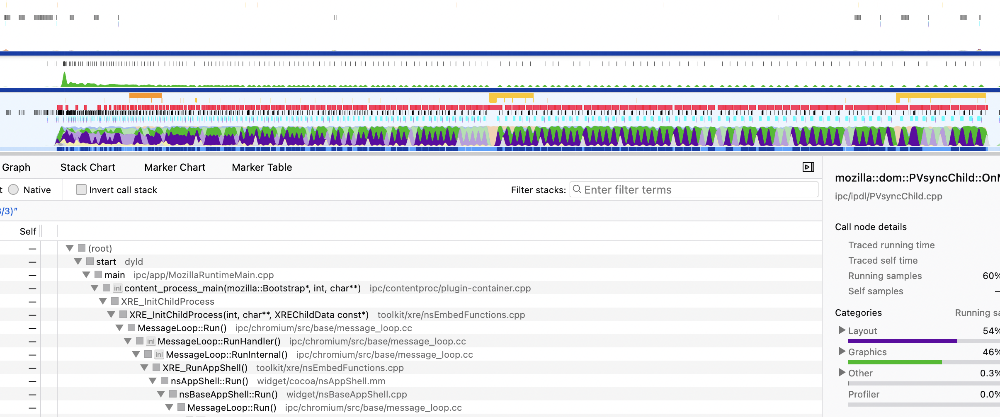

social_tags_title: Задача "Счастливый билетик" - Разделяем задачу на группу подзадач
description: Разделяем задачу на группу подзадач
author: @ollar
date_created: 2023-05-17
is_editable: true

# Разделяем задачу на группу подзадач

## Основная идея

Проблема заключается в том, что наша задача очень ресурсоемкая, и браузер тратит все силы на ее выполнение. В этот момент он не может выполнять запросы к серверу, отрисовывать UI и вообще не хочет нас замечать. Раз тяжело все сделать в одном фрейме, то может быть есть способ разбить задачу на несколько? 

Конечно есть, нам поможет функция отложенного выполнения `setTimeout`. Она позволяет выполнить функцию в каком-то недалеком будущем и браузер сразу планирует её испольнение в другом фрейме.

### Переписываем код

``` js
function runApp(i) {
  if (i === 0) {
    startTime = performance.now();
  }

  if (i >= 999_999) {
    const endTime = performance.now();
    console.log(`Call took ${endTime - startTime} milliseconds`);
    return;
  };

  const $ticket = createTicket(i);
  $app.appendChild($ticket);

  if (i % 5000 === 0) {
    return setTimeout(() => runApp(++i));
  }
  return runApp(++i);
}
```

ФФ - `Call took 23253 milliseconds`

При исполнении этого кода сразу заметно, что кнопки показываюся практически мгновенно.
В профайлере видно, что красная полоса проблем теперь не выглядит монолитно, видны просветы. А задачи js чередуются с рендером.


