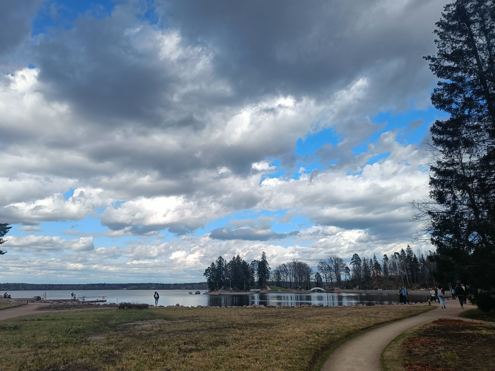
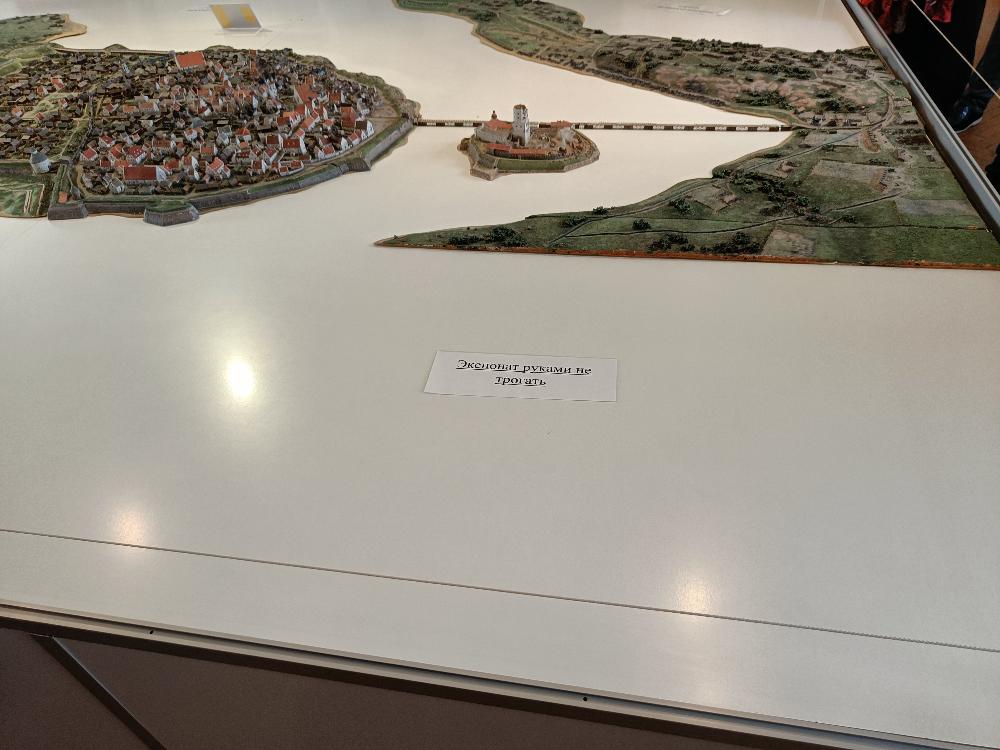
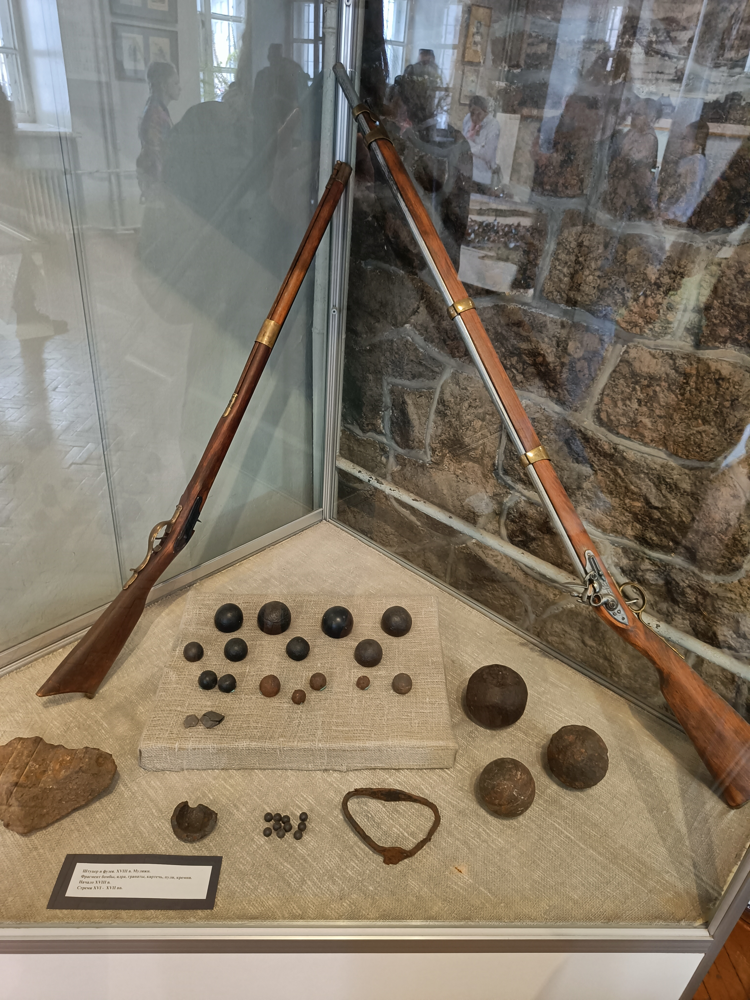

# Выборг

Вы́борг[^Выборг] (фин. Viipuri, швед. Viborg, нем. Wiburg) — город в России, административный центр Выборгского муниципального района Ленинградской области. Образует Выборгское городское поселение (МО «Город Выборг») как единственный населённый пункт в его составе.

Город расположен на берегу Выборгского залива, находящегося в северо-восточной части Финского залива. Это крупный экономический, промышленный и культурный центр Ленинградской области, порт на Балтике, важный узел шоссейных и железных дорог.

Выборг, основанный в Средние века, с 2010 года является единственным историческим поселением на территории Ленинградской области. Среди достопримечательностей — Выборгский замок, парк Монрепо, библиотека Алвара Аалто. Всего в Выборге сосредоточено более трёхсот различных памятников: архитектурных, исторических, скульптурных, археологических, садово-паркового искусства. С марта 2010 года — «Город воинской славы».

[^Выборг]: [Википедия - Выборг](https://ru.wikipedia.org/wiki/%D0%92%D1%8B%D0%B1%D0%BE%D1%80%D0%B3)

## Прогулка по городу

Якоря Холла

### Башня Ратуши

Башня Ратуши[^Башня Ратуши] — это одна из главных достопримечательностей старинного города Выборг. Она была построена в XIV веке и долгое время служила оборонительным сооружением.

В настоящее время в башне находится небольшой музей, который знакомит посетителей с историей и архитектурой этого здания. Кроме того, на верхнем этаже башни расположены панорамные окна, откуда открывается прекрасный вид на исторический центр города.

[^Башня Ратуши]: [Википедия - Башня Ратуши](https://ru.wikipedia.org/wiki/%D0%91%D0%B0%D1%88%D0%BD%D1%8F_%D0%A0%D0%B0%D1%82%D1%83%D1%88%D0%B8_(%D0%92%D1%8B%D0%B1%D0%BE%D1%80%D0%B3))

### Дом купеческой гильдии

Дом купеческой гильдии Святого Духа[^Дом купеческой гильдии] — старинное здание в центре Выборга на углу Выборгской улицы (дом 8) и улицы Новой Заставы, средневековый памятник архитектуры.

[^Дом купеческой гильдии]: [Википедия - Дом купеческой гильдии Святого Духа](https://ru.wikipedia.org/wiki/%D0%94%D0%BE%D0%BC_%D0%BA%D1%83%D0%BF%D0%B5%D1%87%D0%B5%D1%81%D0%BA%D0%BE%D0%B9_%D0%B3%D0%B8%D0%BB%D1%8C%D0%B4%D0%B8%D0%B8_%D0%A1%D0%B2%D1%8F%D1%82%D0%BE%D0%B3%D0%BE_%D0%94%D1%83%D1%85%D0%B0)

### Кордегардия

### Анненские укрепления

Анненские укрепления[^Анненские укрепления] (Корон-Санкт-Анна) — бастионная крепость, редкий памятник русского оборонного зодчества второй четверти XVIII века. Самое значительное фортификационное сооружение XVIII века в Выборге. Также назывались Короно-Санкт-Анская крепость или Анненкрон (нем. Annenkrone — Корона Святой Анны) в честь императрицы Анны Иоанновны.

[^Анненские укрепления]: [Википедия - Анненские укрепления](https://ru.wikipedia.org/wiki/%D0%90%D0%BD%D0%BD%D0%B8%D0%BD%D1%81%D0%BA%D0%B8%D0%B5_%D1%83%D0%BA%D1%80%D0%B5%D0%BF%D0%BB%D0%B5%D0%BD%D0%B8%D1%8F)

### Крепостная улица

### Часовая башня

### Кафе-трамвай

### Самый старый жилой дом в России

Дом горожанина[^Дом горожанина] — Невысокий двухэтажный дом башенного типа с подвалом и толстыми стенами, сложенными из гранитных валунов, наряду со сходными усадьбой бюргера, домом купеческой гильдии Святого Духа и ещё одним гильдейским домом, входит в четвёрку маленьких частных «крепостей» XIV—XVII веков, средневековых бюргерских домов, которые на территории России можно увидеть только в Выборге.

[^Дом горожанина]: [Википедия - Дом горожанина](https://ru.wikipedia.org/wiki/%D0%94%D0%BE%D0%BC_%D0%B3%D0%BE%D1%80%D0%BE%D0%B6%D0%B0%D0%BD%D0%B8%D0%BD%D0%B0_(%D0%92%D1%8B%D0%B1%D0%BE%D1%80%D0%B3))

### Красивые развалины

### Речной порт

## Парк Монрепо

Монрепо́[^Монрепо] (фр. Mon Repos — «мой покой», «моё отдохновение») — скальный пейзажный парк на берегу бухты Защитной Выборгского залива, на острове Твердыш в северной части города Выборга в Ленинградской области. Официальное наименование — Государственный историко-архитектурный и природный музей-заповедник «Парк Монрепо». Находится в Петровском микрорайоне Выборга, рядом с Северным и Выборгским посёлками.

[^Монрепо]: [Википедия - Монрепо](https://ru.wikipedia.org/wiki/%D0%9C%D0%BE%D0%BD%D1%80%D0%B5%D0%BF%D0%BE)

### Главные ворота

Въездные деревянные ворота в неоготическом стиле, украшенные стрельчатыми башнями и металлическим декором. Воссозданы в ходе реставрации.

### Камень китайского зонтика

Восточный мудрец Вэнь Чженьхэн говорил: «Один валун должен явить красоту тысячи пиков». Такой красавец-валун есть и в парке Монрепо. К нему приведет тропинка, которая уходит вправо от входных ворот.[^Камень китайского зонтика]

[^Камень китайского зонтика]: [monreposmuseum.ru - Камень китайского зонтика](https://monreposmuseum.ru/obekty-parka/kamen-kitajskogo-zontika/)

### Обелиск братьям Броглио

### Погреб-ледник

### Дом садовника

### Капелла Людвигсбург на острове Людвигштайн»

### Хижина отшельника

### Грот Желаний

### Край света

### Храм Нептуна

## Выборгский замок

Выборгский замок[^Выборгский замок] был основан в 1293 году во время третьего шведского крестового похода. Морское ополчение высадилось на побережье Финского залива в районе нынешнего Выборга и разорило поселение карел и карельский сторожевой пункт на небольшом острове. Шведы заложили на острове замок и назвали его Выборгом (в переводе со старошведского — «Святая крепость»).

О первоначальном облике замка достоверных сведений не сохранилось. Археологические исследования показали, что вокруг центральной возвышенной части острова (современный Кузнечный двор) была сооружена каменная стена. А в центре острова — возведена четырехугольная каменная башня-донжон. Шведы назвали ее башней Святого Олафа в честь короля Олафа II Харальдссона, утвердившего христианство в Норвегии.

[^Выборгский замок]: [vyborgmuseum.org - История Выборгского замка](http://vyborgmuseum.org/history/)

### Музеи замка

К столетию со дня рождения Ленина, в апреле 1970 года, в Выборгском замке открылась первая постоянная экспозиция — «Историческое и революционное прошлое края». Чуть позже появилась самая старая из ныне действующих выставок — экспозиция «Карельский перешеек в годы Великой Отечественной войны»[^История музея]

[^История музея]: [vyborgmuseum.org - история музея](http://vyborgmuseum.org/history/museum/)

## Сваргас

Средневековый город Cваргас - столица варяжских земель[^Сваргас]

Историко - этнографический музей под открытым небом, воссозданный в натуральную величину, как крепость балтийских славян – венедов периода раннего средневековья VIII - XII в.в., в период зарождения Российской государственности. "Сваргас" — индоевропейское слово, переводится как «Солнечное небо». (Местоположение: 60.82799 28.83713)

[^Сваргас]: [Cваргас](https://www.swargas.ru/)

